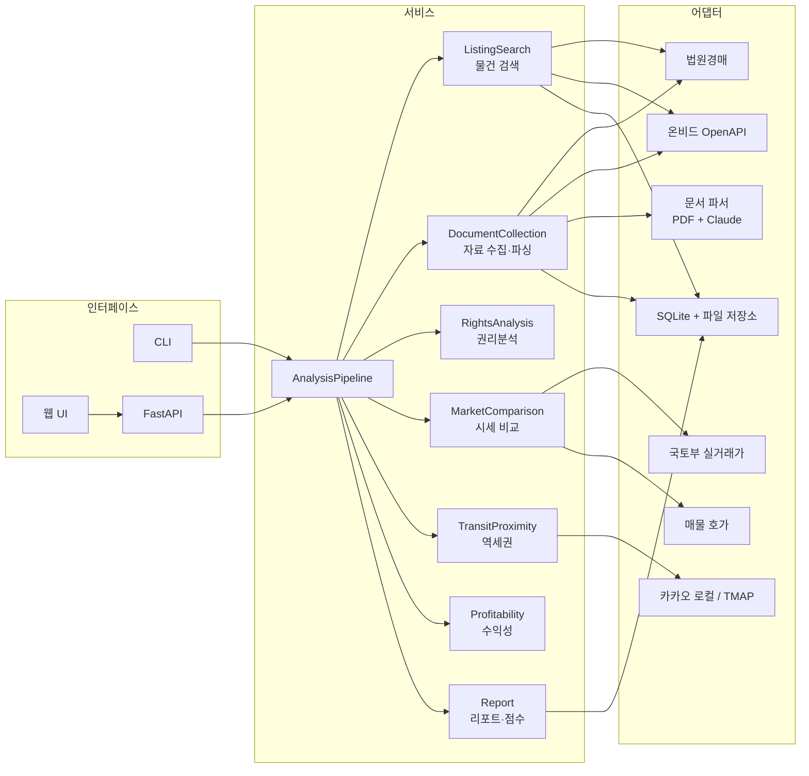
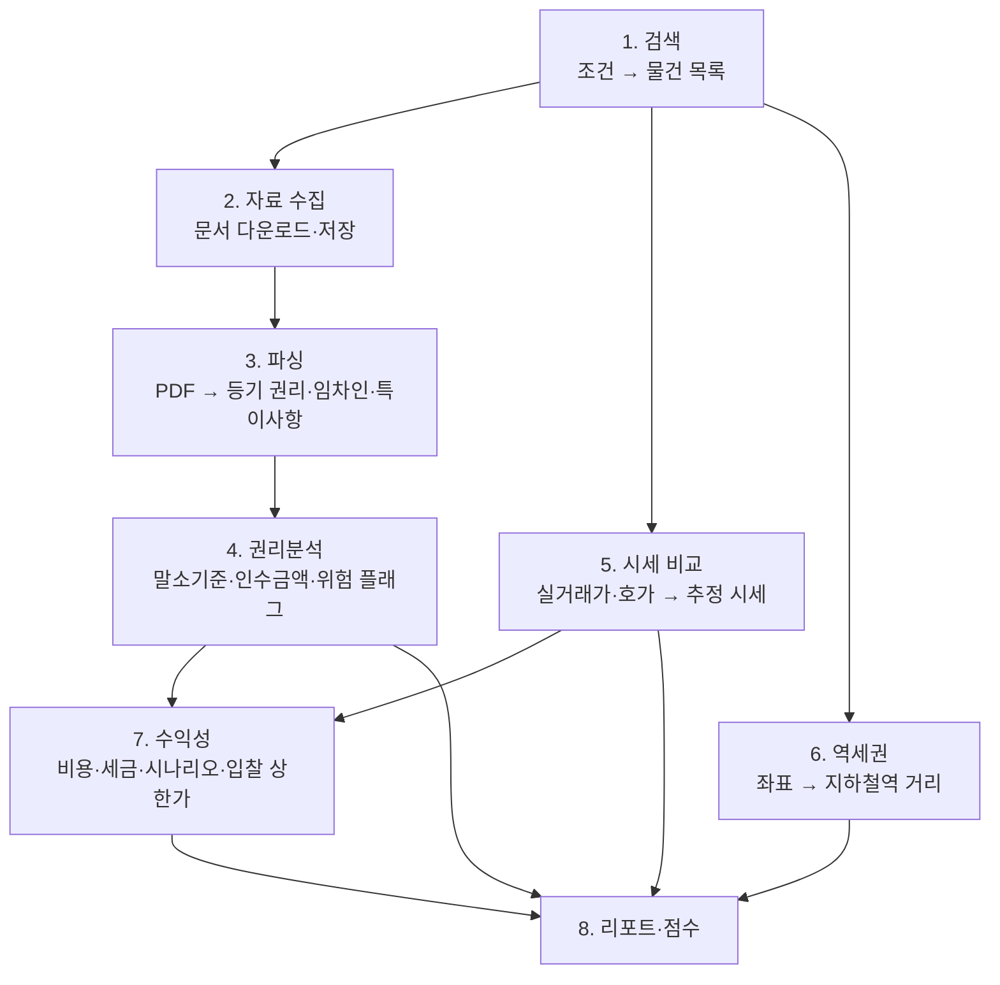

# 아키텍처

## 1. 목표와 범위

경매·공매 물건 하나에 대해 "입찰할 만한가, 얼마까지 써도 되는가"를 판단할 수 있는 리포트를 만든다.

- 개인용 단일 사용자 앱으로 시작한다. 로그인·권한은 범위 밖이다.
- 물건 한 건의 분석은 자동 파이프라인으로 끝까지 돌고, 사람이 확인해야 하는 부분(특수 권리, 불확실한 추출값)은 플래그로 표시한다.

## 2. 전체 구조

모듈러 모놀리스 + 포트/어댑터 구조. 서비스는 외부 사이트·API를 직접 호출하지 않고 포트(인터페이스)에만 의존한다.



## 3. 계층과 의존 규칙

| 계층 | 위치 | 역할 | 의존 가능 대상 |
|---|---|---|---|
| 도메인 | `domain/` | 물건, 문서, 권리, 시세, 위치, 수익 모델. 표준 라이브러리만 사용 | 없음 |
| 포트 | `ports.py` | 외부 연동 인터페이스(Protocol) | 도메인 |
| 서비스 | `services/`, `pipeline.py` | 업무 로직. 권리분석·수익 계산은 순수 함수 | 도메인, 포트 |
| 어댑터 | `adapters/`, `storage/` | 사이트·API·DB·파일 구현체 | 도메인, 포트 |
| 인터페이스 | `cli.py`, `api/` | 입력을 받아 파이프라인 호출, 어댑터 조립 | 전부 |

권리분석과 수익 계산은 입력(등기 권리, 임차인, 가격)만 받는 순수 함수로 두어, 네트워크 없이 사례 기반 테스트를 할 수 있게 한다.

## 4. 분석 파이프라인



4·5·6은 서로 독립이고, 7은 권리분석의 인수금액과 시세 추정값을 입력으로 받는다. 각 단계 결과는 물건 ID 기준으로 저장해 단계별 재실행이 가능하다.

## 5. 외부 데이터 소스

| 용도 | 소스 | 접근 방식 | 비고 |
|---|---|---|---|
| 경매 물건·문서 | 법원경매정보 (courtauction.go.kr) | 스크래핑 | 공식 API 없음. 저빈도 호출, 캐시 필수 |
| 공매 물건 | 온비드 (KAMCO) | 공공데이터포털 OpenAPI | 서비스 키 필요 |
| 등기사항증명서 | 인터넷등기소 | 사용자 업로드 | 유료 발급이라 자동 수집하지 않음 |
| 건축물대장 | 건축HUB | 공공데이터포털 OpenAPI | 위반건축물 여부 확인 |
| 실거래가 (매매·전월세) | 국토교통부 | 공공데이터포털 OpenAPI | 법정동 코드 5자리 + 계약년월로 조회 |
| 매물 호가 | 네이버 부동산 등 | 미정 | 공식 API 없음. 아래 미결 사항 참조 |
| 주소 → 좌표, 주변 역 | 카카오 로컬 API | REST | 카테고리 `SW8`(지하철역), 직선거리 제공 |
| 도보 거리·시간 | TMAP 보행자 경로 API | REST | 선택. 없으면 직선거리 기반 추정 |
| PDF 구조화 추출 | Claude API | SDK | 추출값마다 근거 문장과 신뢰도를 함께 저장 |

각 API의 엔드포인트·필드는 해당 어댑터를 구현할 때 최신 명세로 확인한다.

## 6. 기술 스택

| 영역 | 선택 | 이유 |
|---|---|---|
| 백엔드 | Python 3.12+ | 스크래핑, PDF 처리, 데이터 분석 생태계 |
| API | FastAPI + Pydantic | 타입 기반 스키마, 문서 자동 생성 |
| 저장 | SQLite (SQLAlchemy 2) + 로컬 파일 | 개인용 MVP. 저장소 인터페이스 뒤에 두어 PostgreSQL로 교체 가능 |
| HTTP·스크래핑 | httpx, 필요 시 Playwright | 법원경매 사이트가 JS 렌더링을 요구할 때만 Playwright |
| PDF | pdfplumber + Claude API | 텍스트 추출 후 구조화. 스캔본은 Claude에 PDF 직접 전달 |
| 웹 | Next.js + TypeScript + 카카오맵 | 지도 위 물건·역·비교 거래 표시 (Phase 6) |
| 품질 | pytest, ruff | |

의존성은 해당 기능을 구현하는 단계에서 `pyproject.toml`에 추가한다.

## 7. 프로젝트 구조

```
auction-lens/
├─ README.md
├─ .env.example
├─ docs/
│  ├─ ARCHITECTURE.md        이 문서
│  ├─ SERVICES.md            서비스·함수 정의
│  └─ ROADMAP.md             단계별 계획
├─ backend/
│  ├─ pyproject.toml
│  ├─ src/auction_lens/
│  │  ├─ domain/             순수 도메인 모델
│  │  │  ├─ listing.py       물건, 검색 조건
│  │  │  ├─ document.py      문서, 파싱 결과
│  │  │  ├─ rights.py        등기 권리, 임차인, 권리분석 결과
│  │  │  ├─ market.py        실거래, 호가, 시세 비교 결과
│  │  │  ├─ location.py      좌표, 역 거리
│  │  │  ├─ profit.py        비용, 가정, 수익 시나리오
│  │  │  └─ report.py        종합 리포트
│  │  ├─ ports.py            외부 연동 인터페이스
│  │  ├─ services/
│  │  │  ├─ listing_search.py
│  │  │  ├─ document_collection.py
│  │  │  ├─ rights_analysis.py
│  │  │  ├─ market_comparison.py
│  │  │  ├─ transit_proximity.py
│  │  │  ├─ profitability.py
│  │  │  └─ report.py
│  │  ├─ pipeline.py         단계 오케스트레이션
│  │  ├─ adapters/           (Phase 1~) court_auction, onbid, molit_trade,
│  │  │                      kakao_local, tmap, document_parser
│  │  ├─ storage/            (Phase 1~) db, repositories, file_store
│  │  ├─ rules/              (Phase 4~) 소액임차인 기준표, 세율표 등 개정되는 수치
│  │  ├─ cli.py              (Phase 1~)
│  │  └─ api/                (Phase 6~) FastAPI 라우터
│  └─ tests/
└─ web/                      (Phase 6~) Next.js
```

`(Phase N~)` 표시는 아직 만들지 않은 항목이다.

## 8. 저장 모델

| 테이블 | 내용 |
|---|---|
| `listings` | 물건 기본 정보. 키는 `{source}:{사건번호 또는 물건관리번호}:{물건번호}` |
| `documents` | 다운로드·업로드한 문서 메타데이터. 파일은 `data/documents/{listing_id}/`에 저장, sha256으로 중복 방지 |
| `parsed_documents` | 문서별 추출 결과(JSON), 파서 버전 |
| `analyses` | 권리분석·시세·역세권·수익성·리포트 결과 스냅샷(JSON), 종류와 생성 시각 |
| `trade_records` | 실거래가 캐시 (법정동 코드 + 계약년월 단위) |

법이나 세율이 바뀌는 수치(소액임차인 최우선변제 기준, 취득세·양도세율, 법원별 유찰 저감률)는 코드가 아닌 `rules/` 데이터 파일로 관리하고, 분석 결과에 적용한 기준 버전을 남긴다.

## 9. 결정 사항과 미결 사항

결정:

- 개인용 단일 사용자, 로컬 실행을 기준으로 한다.
- 공식 API가 있는 온비드부터 구현하고, 법원경매 스크래핑은 그다음에 붙인다.
- 등기사항증명서는 사용자가 PDF를 올리는 방식으로 받는다. 없으면 매각물건명세서 기준으로 분석하고 리포트에 그 사실을 표시한다.
- 권리분석은 규칙 기반으로 판정하고, Claude는 문서에서 값을 뽑는 데만 쓴다. 판정 근거를 항상 함께 남긴다.

미결 (구현 전에 정해야 함):

1. **법원경매 수집 범위** — 사이트 이용 약관과 호출 빈도 제한을 확인한 뒤 수집 주기와 범위를 정한다.
2. **매물 호가 소스** — 공식 API가 없다. 우선 실거래가만으로 시세를 추정하고, 호가는 별도 어댑터로 추가할지 정한다.
3. **UI 형태** — 웹(Next.js + 지도)을 가정했다. CLI와 리포트 파일만으로 충분한지 Phase 5 이후 판단한다.
4. **대상 물건 종류** — 아파트·다세대부터 시작하고 토지·상가는 이후로 미루는 것을 가정했다.
